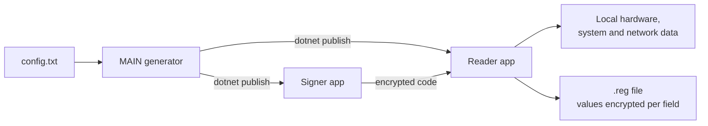

# FirmaDigital

Configurable redesign of Firma-DPP. A generator application (`MAIN`) reads a
`config.txt` file and builds two self-contained Windows applications: a **signer**, used by
the technician, and a **reader**, run on the customer's PC. Together they produce and verify
an encrypted, per-installation record stored as a `.reg` file.

> This repository contains security-sensitive implementation details and is therefore not
> publicly distributed.

## Problem

The first version (Firma-DPP) had a fixed format and fixed protection material in its code.
The redesign needed configurable fields, names and icons per deployment, authenticated
encryption, and a clean separation between what the technician declares and what is
collected on the customer's machine.

## Architecture

- **Configuration-driven fields:** any number of `[FIELD…]` sections — text, lists,
  multi-select, constants, dates and automatic Windows/hardware/network providers — each
  marked as captured by the signer or by the reader.
- **Strict capture separation:** the signer's code can only contain signer fields; the
  reader rejects codes that try to include reader fields.
- **Self-contained outputs:** the generated apps need neither `MAIN`, `config.txt` nor an
  installed .NET runtime.
- **Headless mode** (`--headless --config … --output …`) for scripted builds.
- **Optional Authenticode signing** of `MAIN` and the generated apps, with the certificate
  supplied through environment variables, never from the repository.

## Technical decisions

- **AES-256-GCM** authenticated encryption; keys derived with **PBKDF2-HMAC-SHA256**
  (configurable iterations, minimum enforced) and a per-payload key derived with HMAC and a
  random salt; each value is encrypted independently with associated data that binds it to
  the configuration and the field name.
- **Access password stored as a PBKDF2 verifier**, with a configurable attempt limit.
- **Reproducible builds** pinned through `global.json`, with a Docker build option and a
  test project.

## Security scope (stated honestly)

The generated applications must encrypt and decrypt without a server, so they necessarily
contain key material that could be recovered with advanced analysis. This is documented as
protection against casual exposure, not as the equivalent of a key held in hardware or on a
server.

## Stack

C#, .NET 10, Windows Forms, `System.Security.Cryptography`, PowerShell build scripts,
Docker, Authenticode (`signtool`).

## Status

Implemented and documented (configuration manual, full configuration reference,
architecture, security model, code signing and requirements matrix).

## Why the code is private

The generated applications are distributed to customer machines; publishing the
generation mechanism and storage format would make it easier to extract key material from
a distributed reader and forge records.
