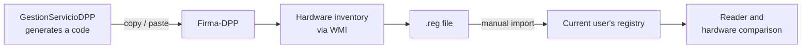

# Firma-DPP

Windows desktop companion to the GestionServicioDPP web application. After a technician
installs software on a customer's PC, the tool records a technical "signature" of that
installation — who installed what and when, plus a hardware inventory of the machine — and
later reads it back to check whether the hardware still matches.

> This repository contains security-sensitive implementation details and is therefore not
> publicly distributed.

"Signature" here means a technical record of an installation. It is not a PKI digital
signature and does not prove anyone's identity.

## Flow

1. An authorized user generates a code in the web application.
2. The code is pasted into the desktop tool, which validates it and collects the operating
   system, user, motherboard, CPU, disks and RAM through WMI.
3. The tool writes a `.reg` file; the operator reviews it and imports it manually.
4. The reader lists stored signatures, shows details, flags a possible hardware mismatch
   ("possible cloned PC") and can delete an entry after confirmation.

## Technical decisions

- **Manual, reviewable steps** (copy/paste in, `.reg` file out, manual import) instead of
  network calls or silent registry writes.
- **Per-user storage** under the current user's registry hive, with random subkeys so
  signatures do not overwrite each other.
- **Compatibility first:** the code format is shared with the existing web application, so
  any change to it requires an end-to-end test with both sides.

## Security scope (stated honestly)

Version 1.0 is documented in its own security policy as **obfuscation, not a security
control**: it is not suitable as the only mechanism for licensing, compliance or clone
detection. Its limitations led to the redesign described in
[FirmaDigital](../firma-digital/README.md).

## Stack

C#, .NET Framework 4.7.2, Windows Forms, WMI, MSBuild, GitHub Actions build, Docker image
used only as a build environment (Windows containers).

## Status

v1.0.0 released internally. No automated tests; verification is a documented manual
procedure.

## Why the code is private

The shared format and the embedded protection material would let anyone reproduce or
forge signatures if published.
