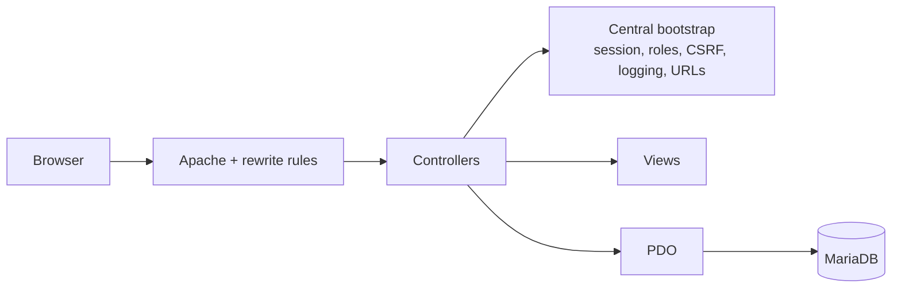

# GestionServicioDPP

Incremental modernization and security hardening of a legacy PHP application used to
manage technical service jobs, customers, installed programs, employees and users.

> Source code is private due to security and intellectual-property considerations.

## Problem

The application was procedural PHP with hard-coded URLs, mutating GET links, error
messages that exposed database details and no consistent session, role or CSRF handling.
It was in daily use, so it could not be rewritten at once: every change had to keep it
working.

## Approach

A phased plan (inventory and baseline → configuration and URLs → reuse → authentication
and authorization → database → frontend → tests → production readiness → documentation),
with a verified baseline before each change and small, reversible batches.

## Improvements implemented

- **Configuration from the environment** (`.env` locally, hosting variables in production);
  no credentials in PHP, SQL, Docker images or documentation. `.env` is blocked over HTTP.
- **Central bootstrap** for URL generation, authentication, role checks, POST-only actions,
  CSRF tokens and structured logging.
- **Sessions:** strict mode, HttpOnly/SameSite cookies, ID rotation on login and logout, and
  revocation when a user's role changes or the user/employee is deactivated.
- **Role-based write matrix** enforced in controllers, and write forms not rendered for
  read-only roles. Service history limited to each installer's own records.
- **Mutations moved from GET links to POST + CSRF**; generic error messages to users with
  details only in logs.
- **Uploads** validated by size, MIME type and content, stored with random names outside
  the executable PHP tree; direct execution of files under `views/` blocked.
- **Friendly routes** via rewrite rules instead of exposing controller file names.
- **Login attempt tracking** through a versioned SQL migration.
- **Docker Compose** environment (PHP 8.2 + Apache + MariaDB) with a health check endpoint
  that reveals no connection details.
- **CI** (GitHub Actions): PHP lint, JavaScript syntax check, Compose validation and shell
  syntax check. An HTTP security smoke test script is run locally.

## Stack

PHP 8.2, Apache, PDO, MariaDB 10.4, PhpSpreadsheet, Bootstrap, Docker Compose,
GitHub Actions.

## My responsibilities

Baseline analysis, modernization plan, security hardening, Docker environment, CI and
documentation.

## Status

Security and configuration phases are largely implemented; some legacy views are kept
only for traceability and must be migrated before reuse. Further phases (automated
tests, production readiness) are pending.

## Why the code is private

It is an internal business application whose repository also contains operational data
that must not be distributed.
