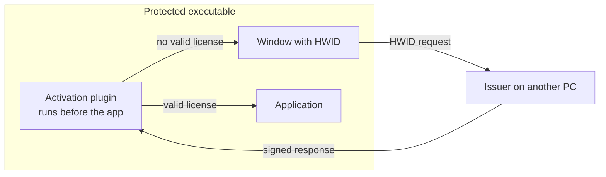

# Hwid-Keygen-Core

Offline activation layer, bound to a hardware ID, for Windows executables that are
protected with the commercial WinLicense protector and for which only the compiled `.exe`
is available.

> Source code is private due to security and intellectual-property considerations.

## Problem

The protected application must refuse to run until it is activated for a specific machine,
activation must work without a network connection, and the source code of the application
itself is not available, so the check cannot be added by recompiling it.

## Approach

WinLicense can embed a native plugin DLL into an executable at protection time and call it
before the application code runs. Hwid-Keygen-Core uses that extension point: the plugin
computes a hardware identifier, shows it in an activation window, and only lets the
application start when a valid, signed response for that identifier is present. The
response is produced on a separate issuer machine.

| Component | Role |
|---|---|
| Portable core | Base64, SHA-256, dates, request/response protocol, license storage and validation |
| Crypto | ECDSA P-256 signing and verification through Windows CNG |
| Hardware ID | Fingerprint collected from local hardware information |
| Client plugin | Activation window and license check executed by the protector at start-up |
| Issuer | Window where the operator pastes the request and generates the signed response |
| Tests | Portable tests for the core, runnable with CMake/CTest on any platform |

## Technical decisions

- **The product-specific check is our own code, not the protector's hardware lock**, so the
  identifier and the policy can be controlled and tested independently. WinLicense still
  provides the anti-tamper and anti-debug layer around it.
- **Signatures instead of shared secrets.** The protected executable only contains a public
  verification key; the private key stays on the issuer machine and is excluded from Git.
- **Portable core separated from Windows code**, so protocol and storage logic can be unit
  tested outside Windows with a test double in place of CNG.

## Stack

C++17, Win32 API, Windows CNG (bcrypt), CMake/CTest, Visual Studio solution (x86/x64).
The WinLicense SDK is a separate commercial product and is not redistributed.

## My responsibilities

Activation design document, portable core, CNG signer, client plugin, issuer and tests.

## Status

- **Implemented:** portable core, CNG signer, client plugin and issuer.
- **Tested:** portable core tests pass with CMake/CTest.
- **Pending:** building and running the plugin inside a WinLicense-protected executable on
  Windows (end-to-end acceptance).

## Why the code is private

It implements a licensing and activation mechanism and integrates with a commercial SDK
whose material cannot be redistributed. Publishing it would reduce the protection it is
meant to provide.
