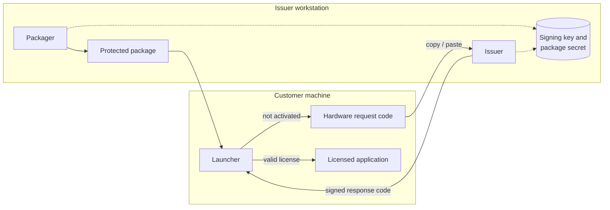

# LICENSE-SERVICE

Offline licensing system that turns an existing, compatible .NET Windows executable into a
protected package whose payload only runs on the device it was licensed for.

> This repository contains commercial and security-sensitive implementation details and is
> therefore not publicly distributed.

## Problem

Small desktop applications were delivered to customers without any license control, and
the target machines are not always online. The goal was a licensing flow that:

- does not require a server or an internet connection on the customer machine;
- binds a license to one device and to an expiration date;
- works with an already-built executable, without changing its source code;
- keeps every secret needed to issue licenses on the issuer workstation only.

## Architecture

| Component | Role |
|---|---|
| Core library | Hardware fingerprint, request/response encoding, license issuing and validation, payload bundle and manifest integrity |
| Packager | Wraps a compatible .NET executable into a launcher with an encrypted payload and an embedded manifest |
| Launcher | Runs on the customer machine: shows the hardware request, installs the license and starts the payload |
| Issuer | UI and CLI that turn a hardware request into a signed, time-limited response |
| Self-test | Console test that exercises round-trips, tamper detection and expiration |

## Technical decisions

- **Asymmetric signatures for licenses.** Licenses are signed with ECDSA P-256; the
  launcher only holds the public key, so a distributed package cannot mint licenses.
- **Authenticated encryption** (AES-GCM) for the license file and the packaged payload; the
  payload is not stored as a plain executable inside the package.
- **Manifest integrity** with HMAC-SHA256 so package metadata cannot be edited silently.
- **Separation of public and secret material.** Issuing requires two secrets that never
  leave the issuer workstation; the repository's ignore rules exclude them explicitly.
- **Offline copy/paste activation** instead of files or network calls, which keeps the flow
  usable on restricted machines.
- **Docker cross-publishing** of the Windows executables from a Linux host for reproducible
  builds.

## Security scope (stated honestly)

The license file is encrypted and authenticated, but it lives on the customer machine, and
no local-only protection is fully resistant to an administrator of that machine. Code
signing and obfuscation are treated as additional layers, not guarantees.

## Stack

C#, .NET 10 (`net10.0-windows`), Windows Forms, `System.Security.Cryptography`
(ECDsa, AesGcm, HMACSHA256), Docker.

## My responsibilities

Design and implementation of the whole solution: core library, packager, launcher, issuer
UI/CLI, self-tests, Docker build, and the user and operator manuals.

## Status

Implemented and documented (user manual and operator manual, including key rotation).
Automated checks are a console self-test; there is no CI pipeline in the repository.

## Why the code is private

Publishing the implementation of a licensing system makes it easier to study and attack.
The repository is kept private to protect that mechanism and the issuing process.
