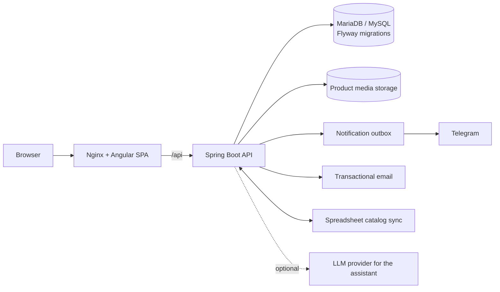

# VENTAS_DPP

Storefront and back office for a company that sells diagnostic software licenses and
program packages. It replaced a Shopify storefront with an Angular frontend and a Spring
Boot API, keeping a "purchase request" model (no online payment) handled by a sales team.

> This repository contains a client's brand, catalog and operational configuration and is
> therefore not publicly distributed.

## Problem

The business needed more than the hosted storefront offered: bundles of programs, offers
with explicit validity, customer accounts, a back office with fine-grained permissions,
notifications to the sales team and catalog synchronization from a spreadsheet — while
keeping the visual identity of the previous store.

## Architecture

Main areas:

- **Public storefront:** catalog with search, filters and sorting; product and bundle
  detail pages; mixed cart; checkout as a purchase request for guests and signed-in
  customers; contact form; newsletter with explicit consent; FAQ and privacy pages.
- **Customer accounts:** email + password followed by a one-time code, email verification
  before registration, password reset, profile and request history.
- **Back office:** dashboard, users, customers, products, brands, categories, bundles, offers,
  orders, notification inbox, email campaigns, catalog synchronization, chatbot knowledge
  and XLSX/PDF exports — each gated by its own permission.
- **Assistant:** a deterministic guided mode with verifiable sources, plus an optional,
  server-side, read-only LLM mode that falls back to guided mode on errors.

## Technical decisions

- **Session in an HttpOnly cookie with CSRF protection**; the token is never exposed to the
  Angular app. Authorization is decided by Spring Security; the UI only hides actions.
- **Permission-based RBAC** (read/write/export/send/manage per module) instead of a few
  coarse roles, with export separated from read access.
- **Transactional outbox** for notifications, with claiming, backoff, attempt limits and
  idempotency, persisted in the same transaction as the order or contact request.
- **Price snapshots** on every request (list price, offer, discount, final price), so
  historical requests do not change when offers expire. Only one winning offer per product.
- **Idempotency keys** for orders and contact requests; rate limits and bot protection on
  public forms.
- **Forward-only Flyway migrations** (39 versioned files) for the whole schema evolution.
- **Guarded catalog synchronization:** dry run first, atomic apply, ownership of each field
  (spreadsheet vs. manual), and a scheduler that is disabled by default.
- **Safe exports:** XLSX with limits and formula neutralization; vector PDF reports.
- **Fail-closed feature switches** for campaigns and the LLM assistant.

## Stack

Angular 20 (standalone components, strict TypeScript), Spring Boot 3.4, Java 17, Spring
Security, Spring Data JPA, Flyway, MariaDB/MySQL, Apache POI, Apache PDFBox, Nginx,
Docker / Docker Compose.

## Tests

- Backend: 258 JUnit tests in the repository (19 skipped) pass with `mvn test`
  (run during the portfolio audit, 2026-09-28).
- Frontend: 36 Angular spec files (`npm test`).
- Phase-by-phase verification reports are kept in the repository.

## My responsibilities

Full-stack design and implementation: Angular frontend and back office, Spring Boot API,
data model and migrations, security, notifications, integrations, exports, Docker setup and
the verification documents.

## Status

Phases up to the guided/LLM assistant are implemented and closed functionally. The live
LLM gate was blocked by the provider's quota, with the guided fallback operational.
Later phases are pending approval. No campaigns, real Telegram notifications or production
deployments have been executed from the project.

## Why the code is private

The repository contains a client's brand assets, catalog data and operational
configuration, and part of the interface derives from a commercial storefront theme.
