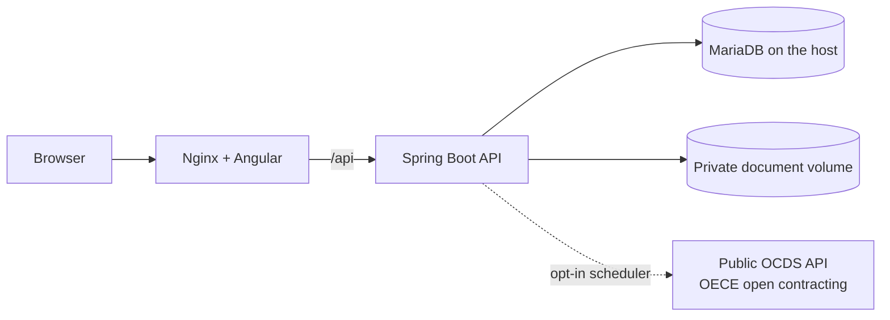

# WEB-VENTA-DE-LICITACIONES

Local web application for a company that sells to public-sector buyers in Peru: a public
product catalog, an internal operations area (sales, accounting, tasks and goals) and a
radar of public procurement opportunities built on open contracting data.

> This repository contains a client's brand, catalog and operational configuration and is
> therefore not publicly distributed.

## Problem

Sales, quotations, invoices, deliveries and warranties were tracked by hand, and finding
relevant public tenders meant searching the procurement portal manually. The system had to
run locally on the company's own Windows machines, without a hosted database.

## Architecture

- **Public area:** catalog, contact and complaints forms.
- **Operations area** with three fixed roles (`ADMIN`, `ACCOUNTANT`, `SELLER`): customers,
  price references, quotations, internal invoices, purchase orders, deliveries, warranties,
  tasks, goals and an audit log.
- **Tender radar:** a scheduled client reads OCDS release packages from the public OECE
  portal, scores them against a configurable match profile and shows the source and data
  freshness of each result. It is disabled by default.
- **Private documents** (PDF/XML uploaded by workers) live in a Docker volume that Nginx
  does not serve.

## Technical decisions

- **Session cookie (HttpOnly) plus CSRF** for every write; roles checked on the backend.
- **Domain modules** in the backend (catalog, customer, quotation, invoice, purchase order,
  delivery, warranty, task, goal, tender, document, audit…) rather than technical layers.
- **Flyway migrations V1–V11** applied on first start.
- **Defensive integration with a public API:** the client stops paginating once it reaches
  data older than the requested mark, caps pages per run, uses a sync lock, and only keeps
  links whose host matches the official source.
- **Passwords never in scripts or arguments:** bootstrap and worker-creation scripts read
  them interactively or from temporary session variables.
- **Whitelisted delivery package** with a SHA-256 side file, so secrets, backups and
  private documents are never packaged.

## Stack

Angular 21, TypeScript, Spring Boot 3.5, Java 17, Spring Security, Flyway, MariaDB 10.4,
Apache POI, Apache PDFBox, Nginx, Docker Compose, PowerShell scripts.

## Tests

The backend suite (79 tests) passes with `mvnw test` (run during the portfolio audit,
2026-09-28). The frontend has unit tests, lint and a production build (`npm test`,
`npm run lint`, `npm run build`); there is no end-to-end suite.

## My responsibilities

Full-stack design and implementation, database schema and migrations, OCDS integration,
local operations scripts (bootstrap, backup/restore, packaging) and documentation.

## Status

V1 delivered for local use. Out of scope by design: automatic tender submission, document
signing and tax-authority integration. External synchronization is off by default.

## Why the code is private

The repository contains a client's brand, product catalog and operational configuration.
